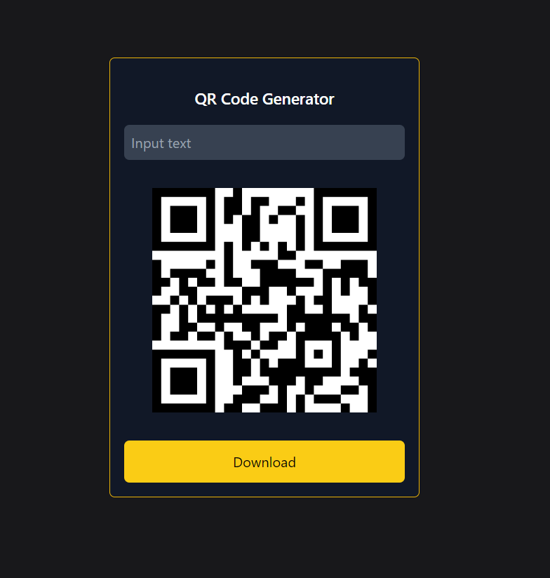

# QR Code Generator

Start pressing the keyboard and it will generate a QR Code for you. If you want to download it, just click here. 👍



## Installation 💖


```
//Download with git clone
git clone https://github.com/enesgkky/qrcode-generator.git

//enter project directory
cd qrcode-generator

//download requirements
npm install

//run the project
npm run dev
```

## Requirements 👇

- React.js
- Node.js
- Npm last version
- QRCode.React
- Tailwindcss


>https://enesgokkaya.com | contact@enesgokkaya.com | enesgkky | Enes Gökkaya
